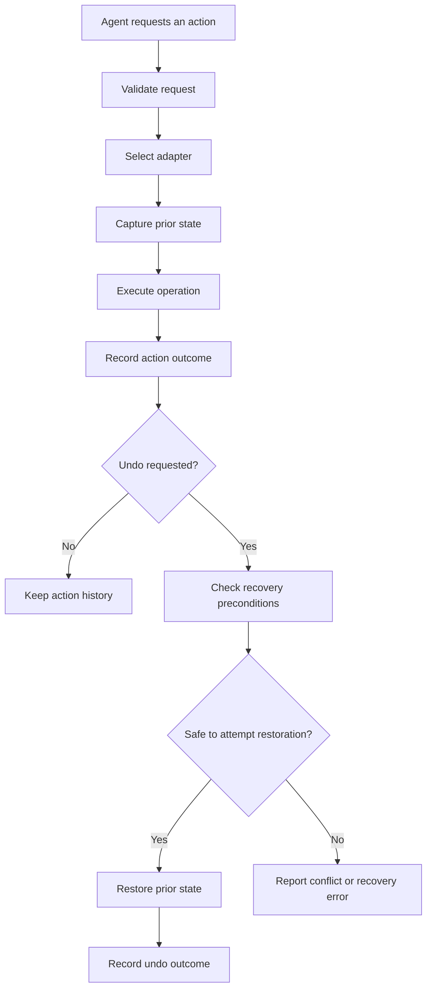

 
<p align="center">
 
</p>

<h3 align="center">Because "my bad" isn't a rollback strategy.</h3>

<p align="center">
  
  
  
  
  <a href="#roadmap">
    
  </a>
</p>

**Make AI-agent actions reversible.**

Mercy is an undo and recovery infrastructure layer for AI agents. It captures state before supported operations, records execution history, and provides mechanisms to reverse changes when something goes wrong.

An AI agent can delete a file, overwrite important data, or modify a database record and then acknowledge its mistake. The problem is that an apology does not restore the previous state.

Mercy is designed to make recovery a built-in capability of agent workflows rather than something developers must implement separately for every operation.

---

## The Problem

AI agents can interact with real systems through tools, APIs, databases, and filesystems. These operations can have unintended consequences.

Consider a few examples:

- An agent deletes a configuration file that another service depends on.
- An agent overwrites a file with incorrect content.
- An agent modifies a database record using the wrong values.
- An agent moves a resource to the wrong location.
- An agent performs multiple operations, and a later operation reveals that an earlier change was incorrect.

Traditional execution logs can tell you what happened, but knowing what happened does not necessarily let you restore the previous state.

Implementing recovery independently for every tool creates duplicated logic and makes it difficult to handle snapshots, execution history, restoration, and conflicts consistently.

**Mercy provides a common recovery layer for supported agent actions.**

## The Solution

Mercy sits between an agent workflow and the systems it modifies.

For supported operations, Mercy can coordinate:

1. **State capture** — preserve the information needed to attempt restoration.
2. **Action execution** — run the requested operation through an appropriate adapter.
3. **Action journaling** — record execution details and outcomes.
4. **Recovery** — use the recorded action and captured state to attempt an undo.
5. **Conflict handling** — detect relevant changes that may make restoration unsafe, where supported.

The objective is to make recovery reusable across integrations without embedding separate undo implementations throughout every agent application.

---

## Core Capabilities

| Capability | Purpose |
|---|---|
| Action journal | Record action execution and lifecycle information |
| Snapshots | Preserve state required for supported recovery operations |
| Undo engine | Coordinate restoration of previously executed actions |
| Filesystem adapter | Support recoverable filesystem operations |
| PostgreSQL integration | Provide database-backed persistence and integration capabilities |
| Runtime | Coordinate journals, snapshots, adapters, execution, and recovery |
| SDK | Provide an application-facing client and transport abstraction |
| HTTP API | Expose supported Mercy operations through an API |
| Custom adapters | Allow integrations with additional systems |
| Action groups | Represent related actions through group-related runtime and journal capabilities |
| MCP integration | Planned interface for exposing Mercy capabilities to MCP-compatible agent workflows; currently in development |

Feature availability depends on the relevant adapter, storage implementation, and integration path.

## Architecture

Mercy is organized as a TypeScript monorepo using Bun workspaces.

```text
mercy/
├── apps/
│   ├── api/                 # HTTP API
│   ├── cli/                 # Command-line application
│   └── dashboard/           # Web dashboard and documentation
│
├── packages/
│   ├── core/                # Shared contracts and action types
│   ├── shared/              # Shared utilities and types
│   ├── journal/             # Action journal implementations
│   ├── snapshots/           # Snapshot storage and management
│   ├── undo/                # Recovery and undo engine
│   ├── filesystem/          # Filesystem adapter
│   ├── postgres/            # PostgreSQL integration and persistence
│   ├── sdk/                 # Application-facing SDK
│   └── runtime/             # Execution and recovery orchestration
│
├── package.json
├── bun.lock
└── README.md
```

*This tree describes the main architectural areas. Verify exact directory names against the current repository before using it as a definitive file inventory.*

### Component responsibilities

**Core contracts**

Define the shared types and interfaces used by the runtime and adapters. Keeping these contracts centralized reduces coupling between the recovery engine and individual integrations.

**Runtime**

Coordinates action execution, journal updates, snapshot operations, adapter selection, and undo requests.

**Journal**

Maintains action history and execution outcomes. The journal provides the information needed to identify an action and determine which recovery operation should be attempted.

**Snapshots**

Capture and retrieve prior state. A snapshot must contain enough relevant information for the associated adapter to attempt restoration.

**Undo engine**

Uses the recorded action and its associated snapshot to coordinate recovery. Undo is not simply a second arbitrary tool call: it must account for the original operation and the current state of the resource.

**Adapters**

Translate Mercy's common action and recovery contracts into operations against specific systems.

**SDK and API**

Provide interfaces through which applications can interact with Mercy without depending directly on its internal implementation.

---

## How Recovery Works

A typical recoverable action follows this lifecycle:



### Example: An agent overwrites a file

Suppose an agent modifies `config.json` and replaces valid configuration with incorrect content.

Without a recovery mechanism, the application needs another way to reconstruct the previous file.

With a compatible Mercy workflow:

1. Mercy captures the relevant prior file state.
2. The filesystem adapter performs the update.
3. The journal records the action and its associated snapshot.
4. A recovery request identifies the original action.
5. Mercy retrieves the required snapshot and asks the adapter to restore the previous state.
6. The recovery result is recorded.

The exact behavior depends on snapshot availability, filesystem permissions, and whether the resource has changed since the original operation.

### Recovery is not guaranteed

Mercy is designed to support recovery, not to promise that every operation can always be reversed.

An operation may be impossible or unsafe to undo when:

- The necessary snapshot is missing or incomplete.
- The resource has been modified by another process.
- External side effects cannot be reversed.
- Permissions prevent restoration.
- The adapter cannot establish that restoration is safe.

Applications should treat recovery as an explicit operation with its own outcome and failure handling.

---

## Supported Operations

### Filesystem

The filesystem adapter has been developed around these operation types:

- `create`
- `update`
- `delete`
- `rename`
- `move`

These operations have different recovery requirements. For example, restoring a deleted file requires its previous content, while undoing a rename requires the original path and appropriate conflict checks.

Use the filesystem adapter as the reference implementation when developing additional integrations.

### PostgreSQL

Mercy includes PostgreSQL integration and persistence components.

Database-backed persistence can support durable action history and related metadata. Recovery of database mutations additionally requires an adapter that captures the relevant prior data and implements appropriate restoration semantics.

Do not assume that enabling PostgreSQL persistence automatically makes every SQL statement reversible. Recovery behavior must be implemented and tested for the specific operation.

### Custom systems

Mercy is designed to support additional integrations through adapters.

Potential integrations include:

- Additional database engines
- Cloud resource management
- External APIs
- Custom internal tools
- Agent-specific operations

These are extension possibilities, not a claim that every integration is currently implemented.

---

## SDK

Mercy includes a TypeScript SDK with client and transport abstractions.

The SDK is intended to separate application code from the details of how Mercy requests are delivered.

The package exports include:

- `MercyClient`
- `MercyClientConfig`
- `MercyTransport`
- `HttpTransport`
- `LocalRuntimeTransport`
- `MercyHttpError`

### HTTP transport

A basic client initialization looks like this:

```ts
import {
  HttpTransport,
  MercyClient,
} from "@mercy/sdk";

const transport = new HttpTransport({
  baseUrl: process.env.MERCY_API_URL!,
  apiKey: process.env.MERCY_API_KEY!,
});

const mercy = new MercyClient(transport);
```

This example assumes the SDK package is available in your application's dependency graph.

For local monorepo development, use the existing workspace dependency conventions. For a published package, use the version distributed through your package registry.

The exact client method signatures should be checked against the current `packages/sdk` implementation before using additional operations in production.

### Local runtime transport

`LocalRuntimeTransport` provides an integration path for a compatible in-process Mercy runtime.

This can be useful when an application needs to invoke Mercy without routing every operation through the HTTP API.

### Security

- Keep API keys on the server side.
- Never commit secrets to source control.
- Avoid exposing privileged Mercy operations directly to untrusted clients.
- Apply authorization and project scoping to requests.
- Validate action parameters before execution.
- Treat undo requests as privileged operations when they can modify important data.

---

## HTTP API

The API provides an HTTP interface to supported Mercy functionality.

The implemented routes have included action execution, undo, and action retrieval.

| Operation | Method | Route |
|---|---|---|
| Execute an action | `POST` | `/projects/:projectId/actions` |
| Undo an action | `POST` | `/actions/:id/undo` |
| Retrieve an action | `GET` | `/actions/:id` |

These routes describe the implementation reported during development. Confirm the current API route definitions before relying on this table as an up-to-date API contract.

The API is built with Hono, and the dashboard uses Clerk for user authentication. Authentication, project authorization, and API-key handling should be evaluated separately from the underlying undo mechanism.

---

## Developing a Custom Adapter

Adapters let Mercy interact with systems beyond its built-in integrations.

A new adapter should define how to execute an operation and how to recover it.

### Implementation checklist

1. Review the shared contracts in `@mercy/core`.
2. Inspect the filesystem adapter for the established implementation patterns.
3. Identify the supported operations.
4. Determine what state must be captured before each operation.
5. Implement execution and error handling.
6. Implement restoration using the captured state.
7. Check for missing resources and relevant external modifications.
8. Add tests for both successful operations and failure paths.
9. Document the adapter's limitations and recovery guarantees.

### Questions every adapter must answer

- What operations does it support?
- Which state must be captured before execution?
- How is the original operation identified?
- What happens when execution partially succeeds?
- How does the adapter restore the previous state?
- How does it detect conflicts?
- What happens if a snapshot is unavailable?
- Which errors can be retried safely?

An adapter should not claim that an operation is reversible unless its restoration behavior has been implemented and tested.

---

## MCP Integration

Mercy's MCP integration is currently in development.

The intended direction is to expose supported Mercy capabilities through an MCP server so compatible agent workflows can invoke recovery-related tools.

Potential tools include operations for creating snapshots, executing supported actions, inspecting action history, and requesting undo.

The intended integration model is adapter-aware: exposed capabilities should reflect the operations and recovery behavior that the configured adapters actually support.

MCP support should not be treated as production-ready until the server, tool contracts, authorization model, and end-to-end recovery flows have been implemented and validated.

---

## Dashboard

Mercy includes a Next.js dashboard for interacting with the platform.

The current UI direction is deliberately minimal:

- Black-and-white foundation
- Thin neutral borders
- Lime accent `#39FF14`
- Technical typography
- Action history and status-oriented layouts

The Overview interface has used mock data during UI development. Sample statistics or recent actions shown in the dashboard should not be interpreted as live production metrics unless connected to actual API data.

The dashboard uses Clerk for authentication, and the documentation is integrated into the existing dashboard application using Nextra.

---

## Development Setup

### Prerequisites

Install the tools required by your current workspace configuration:

- Bun
- Node.js version compatible with the installed Next.js release
- PostgreSQL or a configured PostgreSQL-compatible database
- Git

### Clone the repository

```bash
git clone https://github.com/yogesh201sits/mercy.git
cd mercy
```

Replace the repository URL if the project is hosted under a different remote.

### Install dependencies

```bash
bun install
```

### Configure environment variables

Use the environment templates provided by the repository if available.

Common configuration categories include:

| Variable | Purpose |
|---|---|
| `DATABASE_URL` | PostgreSQL connection string |
| `MERCY_API_URL` | Base URL for the Mercy HTTP API |
| `MERCY_API_KEY` | API credential for authorized SDK requests |
| Clerk publishable key | Dashboard authentication |
| Clerk secret key | Server-side Clerk integration |

The exact variable names for Clerk and database configuration must match the current application configuration. Never commit real credentials.

### Start the application

Run the scripts defined by the root `package.json` and the relevant application package.

For example, the dashboard may have its own development command:

```bash
cd apps/dashboard
bun run dev
```

Check the package scripts before assuming the same command starts the API, database, or entire monorepo.

### Type-check

The dashboard and other workspace packages may have separate validation scripts. The dashboard type-check command used during development is:

```bash
bun run typecheck
```

Run it from the package directory that defines the script.

### Build

For dashboard changes, validate the production build with the corresponding package script:

```bash
bun run build
```

Run the command from `apps/dashboard` when that is where the script is defined.

### Tests

Mercy uses Bun Test. Run the relevant package test scripts and integration tests according to the workspace configuration.

Recovery testing should cover more than successful execution. Include missing snapshots, external modifications, permission failures, and restoration conflicts wherever applicable.

---

## Testing Strategy

Mercy's most important correctness property is that recovery restores the intended prior state without silently overwriting unrelated changes.

### Unit tests

Test:

- Action validation
- Snapshot metadata and retrieval
- Journal lifecycle behavior
- Undo preconditions
- Adapter operation handlers
- Error mapping

### Integration tests

Test the interaction between:

- Runtime and journal
- Runtime and snapshot store
- Runtime and adapters
- Database persistence and recovery
- SDK transports and API routes

### Recovery scenarios

At minimum, validate:

| Scenario | Expected property |
|---|---|
| Create a file, then undo | The created file is removed when restoration is safe |
| Update a file, then undo | Previous content is restored |
| Delete a file, then undo | Captured prior content is restored |
| Rename a file, then undo | The original path is restored |
| Move a file, then undo | The original location is restored |
| Snapshot unavailable | Recovery fails explicitly |
| Resource changed externally | Relevant conflicts are handled safely |
| Action execution fails | Failure is recorded accurately |
| Undo fails | The recovery failure is observable |

The exact expected result should reflect each adapter's contract and conflict policy.

---

## Design Principles

### 1. Recovery is a first-class concern

Undo should not be an afterthought implemented independently in every application.

### 2. Shared contracts, specialized adapters

The runtime should coordinate common behavior, while adapters own system-specific execution and restoration logic.

### 3. Explicit recovery limitations

Mercy should report when restoration cannot be performed safely rather than presenting every action as perfectly reversible.

### 4. Separation of responsibilities

Action history, captured state, execution, and restoration have distinct responsibilities and should remain independently testable.

### 5. Conflict awareness

Restoring an old snapshot without checking relevant intervening changes can destroy newer data. Recovery should account for this risk.

### 6. Testability

Adapters and runtime components should be testable with repeatable unit and integration tests.

---

## Contributing

Contributions should preserve Mercy's shared contracts and make recovery behavior explicit.

Before submitting changes:

1. Follow existing package conventions.
2. Avoid duplicating abstractions that already exist.
3. Add tests for new operations and failure paths.
4. Test undo and conflict behavior where applicable.
5. Update documentation when public interfaces change.
6. Run relevant type checks, tests, and builds.

For adapter contributions, document supported operations and limitations clearly.

---

## The Goal

AI agents will continue to interact with systems that matter. Some actions will fail, some decisions will be wrong, and some tools will do more than intended.

Mercy aims to give developers a consistent way to capture state, understand what happened, and recover from supported actions when things go wrong.

**Because "my bad" isn't a rollback strategy.**
